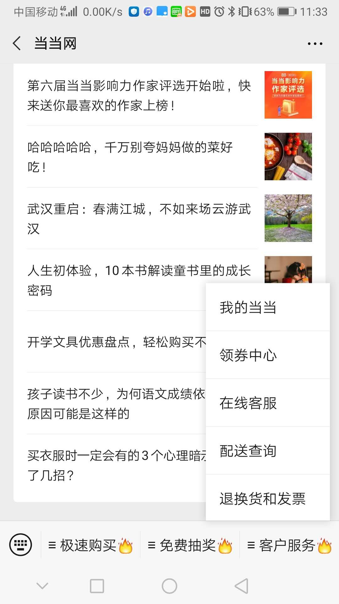
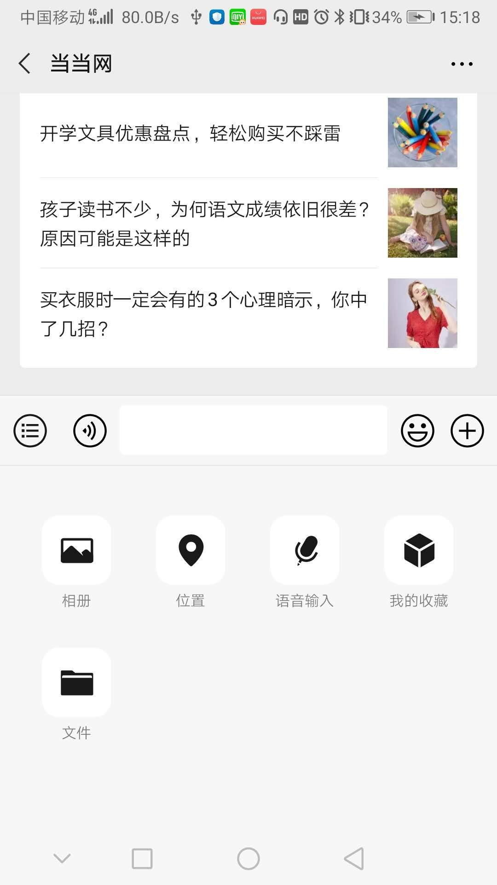
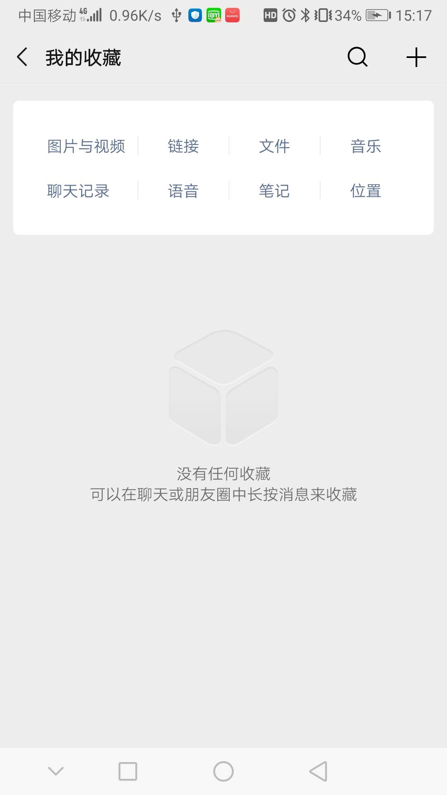
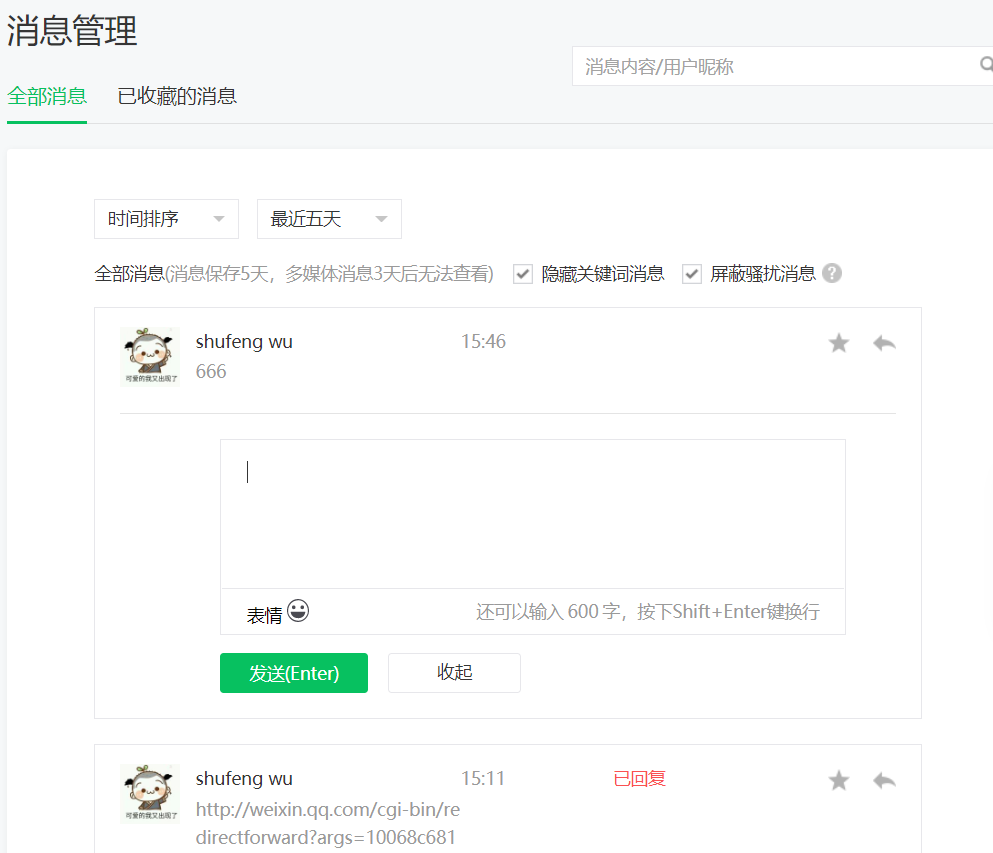
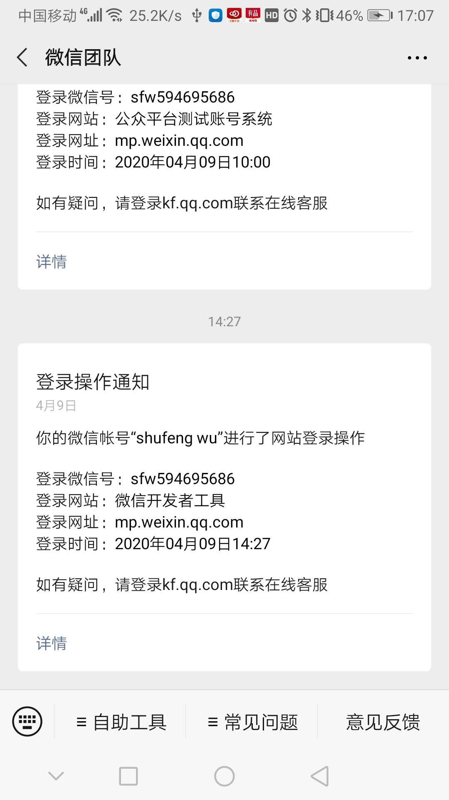
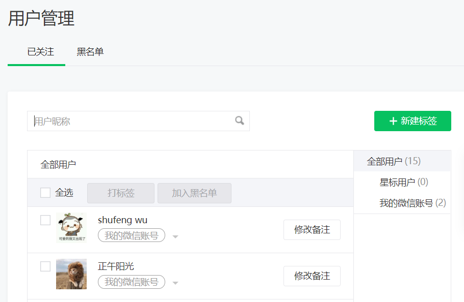
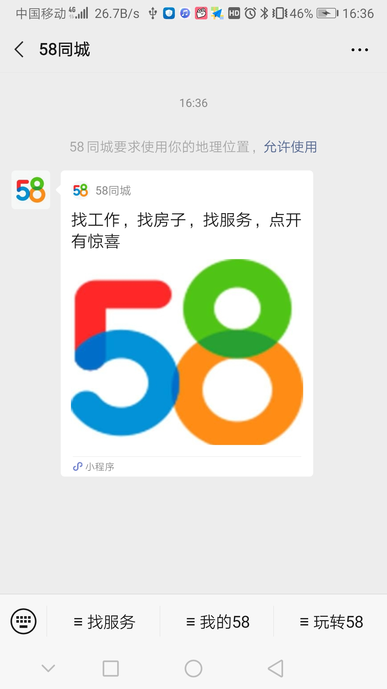
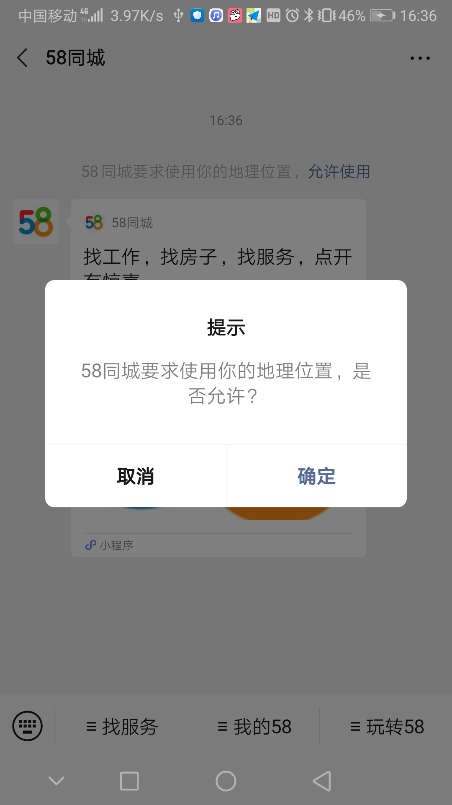

# 微信公众号

## 一、微信公众平台介绍

### 1、账号分类

一般意义上，我们所说的公众号主要是指服务号和订阅号。

#### 区别

 https://kf.qq.com/faq/120911VrYVrA130805byM32u.html 

未认证/认证的订阅号/服务号的接口权限区别，在如下位置查看：

* 腾讯官方开发文档 

  https://developers.weixin.qq.com/doc/offiaccount/Getting_Started/Explanation_of_interface_privileges.html 

查看自己公众号已经获得的接口权限：

公众号管理后台——开发——接口权限

### 2、账号注册

* 注册免费

* 注册流程

  * 个体户
  * 政府
  * 个人
  * 媒体
  * 其他组织
  * [企业](https://kf.qq.com/faq/120911VrYVrA151013MfYvYV.html)

* 数量限制

   同一邮箱只能注册1个帐号类型，在互联网信息内容主管部门的指导下，为加强帐号管理，同一身份证注册个人类型公众号数量上限为1个；同一企业、个体工商户、其他组织资料注册公众号数量上限为2个；同一政府、媒体类型可注册和认证50个公众号。

### 3、账号认证

* 微信认证及年审都是1次300元，海外版99美元1次，不能一次性支付多年审核费用，需要1年1审，无论认证成功或者失败，费用不退还。
* 小程序首次认证通过后，无需再年审。
* 政府机关单位、基金会、国外政府机构驻华代表处认证免费。
*  帐号主体为个人
  * 不支持认证
* 认证申请流程
  * 政府/事业单位
  * 个体工商户
  * 媒体
  * [企业类型](https://kf.qq.com/faq/161220Brem2Q161220uUjERB.html)
  * 其他组织

### 4 、公众号和小程序关联

* 公众号可关联同一主体的10个小程序，不同主体的3个小程序；
* 1个小程序可关联最多500个公众号，1个月可以新增关联500次。
* 公众号关联小程序不要求已发布，但未发布的小程序不可设置展示在公众号资料页、图文消息、自定义菜单等场景。

## 二、功能介绍（订阅号+服务号）

公众号在发送消息的时候可能会使用本地的多媒体文件，例如图片、视频等，而这些素材微信公众号是不允许我们直接发送给用户的，只能上传到微信服务器上，得到 media_id 通过 media_id 去微信服务器查找素材发送给用户，这些上传到微信服务器的素材又分为临时素材和永久素材，本次我们来介绍如何上传临时素材和获取临时素材。

### 1、素材管理

#### 类型

##### 临时素材

* 媒体文件在微信后台保存时间为3天
* 上传临时素材的格式、大小限制：
* 图片（image）: 2M，支持PNG\JPEG\JPG\GIF格式
  * 语音（voice）：2M，播放长度不超过60s，支持AMR\MP3格式
* 视频（video）：10MB，支持MP4格式
  * 缩略图（thumb）：64KB，支持JPG格式
* 目前只能通过开发接口上传。

##### 永久素材

对于常用的素材，开发者可通过本接口上传到微信服务器，永久使用。新增的永久素材也可以在公众平台官网后台素材管理模块中查询管理。

公众号的素材库保存总数量有上限：图文消息素材、图片素材上限为100000，其他类型为1000。

###### 类型

* 图片

  * 10M，支持bmp，png，jpeg，jpg，gif格式

* 音频

  * 格式支持mp3、wma、wav、amr、m4a，文件大小不超过200M，时长不超过1小时

* 视频

  * 视频大小限制在30分钟以内，支持主流的视频格式
    * 常见在线流媒体格式：mp4、flv、f4v、webm
    * 移动设备格式：m4v、mov、3gp、3g2
    * RealPlayer：rm、rmvb
    * 微软格式：wmv、avi、asf
    * MPEG 视频：mpg、mpeg、mpe、ts
    * DV格式：div、dv、divx
    * 其他格式：vob、dat、mkv、lavf、cpk、dirac、ram、qt、fli、flc、mod

* 图文消息

  

  * 每个图文消息素材最多可以增加 8 篇文章。

  * 文章可选类型：

    * 图文（文章）

      内容可包括文字、图片、视频、音频、超链接、小程序、投票、模板等。

      音频除来自素材库，还可以直接搜索音乐插入文章中。

      超链接？？？

    * 视频

      来源：本地上传；素材库；腾讯视频链接；微信公众号文章链接；视频详情页链接

      每篇文章最多添加3个视频。

    * 音频
  
      来源：本地上传；素材库；
    
    * 图片
    
      来源：本地上传；素材库；
    
    * 转载（分享成功并声明原创的文章链接）
    

#### 开发接口

https://developers.weixin.qq.com/doc/offiaccount/Asset_Management/New_temporary_materials.html

* 素材管理接口对所有***认证的***订阅号和服务号开放。
* 临时素材的新增和获取。
* 对永久素材的增、删、改、查。
* 获取素材总数和列表。

### 2、自定义菜单

公众号管理后台——功能——自定义菜单。

官方文档 https://kf.qq.com/faq/120911VrYVrA150210BBJvei.html 

* 最多添加3个一级菜单，菜单名称仅支持中英文和数字，字数不超过4个汉字或8个字母。

* 最多添加5个子菜单，菜单名称 仅支持中英文和数字，字数不超过8个汉字或16个字母。

* 菜单动作
  * 跳转网页 
    
    https://kf.qq.com/faq/120911VrYVrA150212ENnyqM.html 
    
    * 目前非认证订阅号，自定义菜单动作仅支持跳转至素材库文章、历史消息、页面模板，不支持跳转外部链接。
    
  * 跳转小程序
  
    * 可跳转至已绑定的小程序
  
  * 发送消息
    * 纯文字
      
      非认证订阅号不支持设置纯文字类型消息
      
    * 图文消息（素材库，新建，转载）
    
    * 图片
    
    * 音频
    
    * 视频
  
* 开发者接口

   https://developers.weixin.qq.com/doc/offiaccount/Custom_Menus/Creating_Custom-Defined_Menu.html 

  * 可以通过接口实现菜单的创建、查询、删除接口；
  * 个性化菜单，根据用户标签、性别、操作系统、地区、语言设置不同的菜单
  * 事件推送：用户点击自定义菜单后，微信会把点击事件推送给开发者 
  * 通过开发者接口，自定义菜单还可以实现如下动作：
    * 弹出地理位置选择器
    * 弹出扫码页面
    * 弹出微信相册发图器 
    * 弹出拍照或者相册 
    * 弹出系统拍照 

### 3、消息管理

#### 用户发给公众号消息

支持的类型包括文字、表情、音频、图片、视频、位置、文件、链接等。

#### 公众号消息发送方式

##### 自动回复

* 被关注回复

  * 支持文字、图片、音频、视频

  

* 收到消息回复

  * 消息自动回复：1个小时内回复1-2条内容；
  * 支持文字、图片、音频、视频，暂不支持设置图文、网页地址消息回复；
  * 消息自动回复只能设置一条信息回复。

  

* 关键词回复

  https://kf.qq.com/faq/120322fu63YV130422rYNjYB.html 

  

  * 微信公众平台认证与非认证用户的关键词自动回复设置规则上限为200条规则 
  * 每条规则内最多设置10条关键词 ，若设置了相同的关键字，但回复内容不同，系统会随机回复。 
  * 每条规则内最多设置5条回复 , 若设置了多个回复内容（没有设置“回复全部”），系统会随机回复。 

###### 接口

获取公众号当前使用的自动回复规则

https://developers.weixin.qq.com/doc/offiaccount/Message_Management/Getting_Rules_for_Auto_Replies.html

##### 快捷回复

公众号管理后台——管理——消息管理

获取最近五天内的消息，可以对用户的消息进行快捷回复。

##### 即时聊天

公众号管理后台——管理——用户管理

* 头像或者昵称，页面弹出与此用户的聊天页面。

* 可发送的内容包括：文字、图片、音频、视频、图文消息（素材库，新建，转载）。

##### 消息群发

公众号管理后台——管理——素材管理

###### 接口

https://developers.weixin.qq.com/doc/offiaccount/Message_Management/Batch_Sends_and_Originality_Checks.html

1 上传图文消息内的图片获取URL【订阅号与服务号认证后均可用】

2 上传图文消息素材【订阅号与服务号认证后均可用】

> 原创校验

3 根据标签进行群发【订阅号与服务号认证后均可用】

4 根据OpenID列表群发【订阅号不可用，服务号认证后可用】

5 删除群发【订阅号与服务号认证后均可用】

6 预览接口【订阅号与服务号认证后均可用】

7 查询群发消息发送状态【订阅号与服务号认证后均可用】

8 事件推送群发结果

9 使用 clientmsgid 参数，避免重复推送

10 控制群发速度

##### 客服消息

- 公众号可以使用客服功能，在线回复用户询问。
- 客服功能支持多人同时为一个公众号提供客服服务。

###### 1、开通条件

认证公众号

###### 2、开通客服功能

在公众号客服页面可以添加客服:

一个公众号可以添加100个客服。

###### 3、客服登录

绑定完的帐号，可打开[客服功能网页版](https://mpkf.weixin.qq.com/)，已绑定的客服人员可以通过手机微信客户端，进入“扫一扫“，扫描二维码登录客服帐号。

登录后即可看到与公众号对话的用户，可选择接入对话。

选择用户接入，弹出聊天页面：

###### 4、接收消息：

* 手动接入：客服人员上线后，点击待接入，即可在“待接入”列表中，手动接入待回复的对话。

* 自动接入：当待接入的对话太多时，可以在设置/接入设置中，开启自动接入。

* 重新接入：退出登录，或对话超过半小时，需要重新接入，激活对话。

###### 5、发送消息

已经接入的对话，客服人员可以在48小时内和粉丝进行聊天。

* 普通回复：客服人员可以在对话框中发送文字、表情、图片、截图、等类型的消息。

* 快捷回复：可以使用快捷回复中事先编辑好的文本内容进行回复。

###### 6、接口

##### 模板消息

模板消息仅用于公众号向用户发送重要的服务通知，只能用于符合其要求的服务场景中，如信用卡刷卡通知，商品购买成功通知等。不支持广告等营销类消息以及其它所有可能对用户造成骚扰的消息。

1. 入口：功能——添加功能插件——模板消息，但只有**认证后的服务号**才可以申请模板消息的使用权限并获得该权限；
2. 需要选择公众账号服务所处的**2个行业**，每月可更改1次所选行业；
3. 在所选择行业的模板库中选用已有的模板进行调用；
4. 每个账号可以同时使用25个模板。
5. 当前每个账号的模板消息的日调用上限为10万次，单个模板没有特殊限制。当账号粉丝数超过10W/100W/1000W时，模板消息的日调用上限会相应提升，以公众号MP后台开发者中心页面中标明的数字为准。
6. 模板消息可以添加url跳转链接或小程序跳转链接。

管理页面： https://kf.qq.com/faq/170209E3InyI170209nIF7RJ.html

###### 接口

https://developers.weixin.qq.com/doc/offiaccount/Message_Management/Template_Message_Interface.html

1 设置所属行业

2 获取设置的行业信息

3 获得模板ID

4 获取模板列表

5 删除模板

6 发送模板消息

7 事件推送

###### 模板消息运营规范

运营规范：https://developers.weixin.qq.com/doc/offiaccount/Message_Management/Template_Message_Operation_Specifications.html

#### 其他接口

https://developers.weixin.qq.com/doc/offiaccount/Message_Management/Receiving_standard_messages.html

##### 接收普通消息

当普通微信用户向公众账号发消息时，微信服务器将POST消息的XML数据包到开发者填写的URL上。

普通消息包括：文本、图片、语音、视频、小视频、地理位置、链接。

##### 接收事件推送

在微信用户和公众号产生交互的过程中，用户的某些操作会使得微信服务器通过事件推送的形式通知到开发者在开发者中心处设置的服务器地址，从而开发者可以获取到该信息。

* 关注/取消关注事件

* **扫描带参数二维码事件**

* **上报地理位置事件**

  用户同意上报地理位置后，每次进入公众号会话时，都会在进入时上报地理位置，或在进入会话后每5秒上报一次地理位置，公众号可以在公众平台网站中修改以上设置。上报地理位置时，微信会将上报地理位置事件推送到开发者填写的URL。

* **自定义菜单事件**

  用户点击自定义菜单后，微信会把点击事件推送给开发者，请注意，点击菜单弹出子菜单，不会产生上报。

##### 接口调用频次限制说明

https://developers.weixin.qq.com/doc/offiaccount/Message_Management/API_Call_Limits.html

##### 接口权限

| 接口名称                                                     | 未认证订阅号 | 微信认证订阅号 | 未认证服务号 | 微信认证服务号 |
| :----------------------------------------------------------- | :----------- | :------------- | :----------- | :------------- |
| 接收消息-验证消息真实性、接收普通消息、接收事件推送、接收语音识别结果 | 有           | 有             | 有           | 有             |
| 发送消息-被动回复消息                                        | 有           | 有             | 有           | 有             |
| 发送消息-客服接口                                            |              | 有             |              | 有             |
| 发送消息-群发接口                                            |              | 有             |              | 有             |
| 发送消息-模板消息接口（发送业务通知）                        |              |                |              | 有             |
| 发送消息-一次性订阅消息接口                                  |              | 有             |              | 有             |

### 4、用户管理

公众号管理后台——管理——用户管理

* 用户标签：一个公众号，最多可以创建100个标签。
* 黑名单
* 用户备注

#### 开发接口

[官方文档](https://developers.weixin.qq.com/doc/offiaccount/User_Management/User_Tag_Management.html)

* 用户标签管理：对标签进行增、删、改、查，对用户打标签、取消标签。

* 设置用户备注名

* 获取用户基本信息：单个或批量获取用户的昵称、性别、国家、城市、性别、语言、头像、关注时间、备注、标签、用户关注的渠道来源等信息。

  > [OpenID和UnionID机制](https://developers.weixin.qq.com/doc/offiaccount/User_Management/Get_users_basic_information_UnionID.html#UinonId)

* 获取用户列表：获取关注用户列表

* 获取用户地理位置(经纬度)

  

  * 开通了上报地理位置接口的公众号，用户在关注后进入公众号会话时，会弹框让用户确认是否允许公众号使用其地理位置。弹框只在关注后出现一次，用户以后可以在公众号详情页面进行操作。

    > 开通上报地理位置接口方法：
    >
    > 公众号管理后台——开发——接口权限——对话服务——用户管理——获取用户地理位置

  * 用户同意上报地理位置后，每次进入公众号会话时，都会在进入时上报地理位置。

* 黑名单管理：黑名单列表，拉黑，取消拉黑

##### 接口权限

| 接口名称                  | 未认证订阅号 | 微信认证订阅号 | 未认证服务号 | 微信认证服务号 |
| :------------------------ | :----------: | :------------: | :----------: | :------------: |
| 用户管理-用户分组管理     |              |       有       |              |       有       |
| 用户管理-设置用户备注名   |              |       有       |              |       有       |
| 用户管理-获取用户基本信息 |              |       有       |              |       有       |
| 用户管理-获取用户列表     |              |       有       |              |       有       |
| 用户管理-获取用户地理位置 |              |                |              |       有       |
| 用户管理-用户基本信息     |              |                |              |       有       |

### 5、留言管理

公众号管理后台——功能——留言管理

对群发消息的留言进行打开/关闭、查看、置顶、精选、回复、标记垃圾留言、删除等操作。

#### 开发接口

https://developers.weixin.qq.com/doc/offiaccount/Comments_management/Image_Comments_Management_Interface.html

##### 接口权限

认证公众号。

### 6、投票管理

### 7、页面模板

### 8、赞赏管理

### 9、原创管理

### 10、微信门店

### 11、微信小店

### 12、卡券功能

### 13、电子发票

### 14、一物一码

### 15、微信连接Wi-Fi

### 16、统计功能

#### 用户分析

公众号管理后台——统计——用户分析

* 用户增长：新关注人数、取消关注人数、净增关注人数、累计关注人数，以及趋势图

* 用户属性

  * 人口特征：性别、年龄、语言
  * 地域归属：省级分布、地级分布
  * 访问设备：终端分布

* 常读用户分析

  

  常读用户：在订阅号消息列表顶部“常读订阅号”横栏常驻你的公众号的用户。

  * 数量
  * 性别
  * 年龄
  * 城市终端
  * 终端分布

#### 内容分析

公众号管理后台——统计——内容分析

* 群发分析：群发的消息阅读、消息分享等数据的统计
* 视频分析：视频播放量、视频分享等数据的统计

#### 菜单分析

公众号管理后台——统计——菜单分析

菜单项点击次数、人数等数据的统计

#### 消息分析

公众号管理后台——统计——消息分析

* 消息分析：消息发送人数、次数统计
* 消息关键词：消息关键词出现次数统计

#### 接口分析

公众号管理后台——统计——接口分析

基础消息接口的调用次数、失败率、耗时等数据的统计

#### 网页分析

公众号管理后台——统计——网页分析

* JSSDK接口调用数据统计

* JSSDK页面访问量统计

#### 开发接口

https://developers.weixin.qq.com/doc/offiaccount/Analytics/User_Analysis_Data_Interface.html

* 用户分析：用户增减数据、累计用户数据
* 图文分析：图文的阅读、分享、收藏等数据的统计
* 消息分析：关注者消息发送和分布数据
* 广告分析：广告拉取量、曝光量、点击量等。
* 接口分析：基础消息接口的调用次数、失败率、耗时等数据的统计

##### 接口权限

用户分析、图文分析、消息分析、接口分析接口对认证的公众号开放。

广告分析向所有成为流量主(广告分成)的公众号开发者开放数据接口。

## 三、接口接入

### 接入

接入微信公众平台开发，开发者需要按照如下步骤完成：

1、填写服务器配置

2、验证服务器地址的有效性

3、依据接口文档实现业务逻辑

https://developers.weixin.qq.com/doc/offiaccount/Basic_Information/Access_Overview.html

### 接口域名

https://developers.weixin.qq.com/doc/offiaccount/Basic_Information/Interface_field_description.html

### Access token

access_token是公众号的全局唯一接口调用凭据，公众号调用各接口时都需使用access_token。

https://developers.weixin.qq.com/doc/offiaccount/Basic_Information/Get_access_token.html

### 测试号

https://developers.weixin.qq.com/doc/offiaccount/Basic_Information/Requesting_an_API_Test_Account.html

### 在线调试

https://mp.weixin.qq.com/debug/

### 预警排查指引

微信公众平台已对外开放接口报警，当微信服务器向开发者推送消息失败次数达到预定阈值时，会将报警消息发送到指定微信报警群中（设置方式：公众平台->开发-运维中心->接口报警），请开发者积极主动关注报警，即时解决故障，提高微信公众号的服务质量。

## 四、微信网页开发

### 1、iOS WKWebview内核适配

https://developers.weixin.qq.com/doc/offiaccount/OA_Web_Apps/iOS_WKWebview.html

### 2、网页授权

#### 权限要求

认证服务号

#### 添加授权回调域名

在微信公众号请求用户网页授权之前，开发者需要先到公众平台官网中的“开发 - 接口权限 - 网页服务 - 网页授权 - 网页授权获取用户基本信息”的配置选项中，修改授权回调域名。

#### 关于网页授权的两种scope的区别说明

* snsapi_base（静默授权）

  以snsapi_base为scope发起的网页授权，是用来获取进入页面的用户的openid的，并且是静默授权并自动跳转到回调页的。用户感知的就是直接进入了回调页

* snsapi_userinfo

  以snsapi_userinfo为scope发起的网页授权，是用来获取用户的基本信息的。但这种授权需要用户手动同意，并且由于用户同意过，所以无须关注，就可在授权后获取该用户的基本信息。

#### 关于网页授权access_token和普通access_token的区别

* 微信网页授权是通过OAuth2.0机制实现的，在用户授权给公众号后，公众号可以获取到一个网页授权特有的接口调用凭证（网页授权access_token），通过网页授权access_token可以进行授权后接口调用，如获取用户基本信息；
* 其他微信接口，需要通过基础支持中的“获取access_token”接口来获取到的普通access_token调用。

#### 授权流程：

静默授权

非静默授权

.png)

### 3、网页开发样式库——WeUI

https://developers.weixin.qq.com/doc/offiaccount/OA_Web_Apps/web_development_style_library.html

### 4、JS-SDK

功能：

https://developers.weixin.qq.com/doc/offiaccount/OA_Web_Apps/JS-SDK.html

| 接口名称                            | 未认证订阅号 | 微信认证订阅号 | 未认证服务号 | 微信认证服务号 |
| :---------------------------------- | :----------- | :------------- | :----------- | :------------- |
| 微信JS-SDK-基础接口                 | 有           | 有             | 有           | 有             |
| 微信JS-SDK-分享接口                 |              | 有             |              | 有             |
| 微信JS-SDK-图像接口                 | 有           | 有             | 有           | 有             |
| 微信JS-SDK-音频接口                 | 有           | 有             | 有           | 有             |
| 微信JS-SDK-智能接口（网页语音识别） | 有           | 有             | 有           | 有             |
| 微信JS-SDK-设备信息                 | 有           | 有             | 有           | 有             |
| 微信JS-SDK-地理位置                 | 有           | 有             | 有           | 有             |
| 微信JS-SDK-界面操作                 | 有           | 有             | 有           | 有             |
| 微信JS-SDK-微信扫一扫               | 有           | 有             | 有           | 有             |
| 微信JS-SDK-微信小店                 |              |                |              | 有             |
| 微信JS-SDK-微信卡券                 |              | 有             |              | 有             |
| 微信JS-SDK-微信支付                 |              |                |              | 有             |

### 5、web开发者工具

* 调试微信网页授权
* 模拟JSSDK权限校验
* URL收藏与二维码预览
* 移动调试
* Chrome DevTools

https://developers.weixin.qq.com/doc/offiaccount/OA_Web_Apps/Web_Developer_Tools.html

### 6、DarkMode 适配指南

https://developers.weixin.qq.com/doc/offiaccount/OA_Web_Apps/DarkMode.html

## 备注

http://49.234.13.191/getInfo/userinfo

https://open.weixin.qq.com/connect/oauth2/authorize?appid=wxf16ffd378403b525&redirect_uri=http%3a%2f%2f49.234.13.191%2fvideo&response_type=code&scope=snsapi_userinfo&state=snsapi_userinfo#wechat_redirect

http://49.234.13.191/getInfo/base

https://open.weixin.qq.com/connect/oauth2/authorize?appid=wxf16ffd378403b525&redirect_uri=http%3a%2f%2f49.234.13.191%2fvideo&response_type=code&scope=snsapi_base&state=snsapi_base#wechat_redirect

我的公众号appsecret： df4a58ac5f34b198d5fae4776ab8943d