# 微信公众号

## 一、微信公众平台介绍

### 1、账号分类

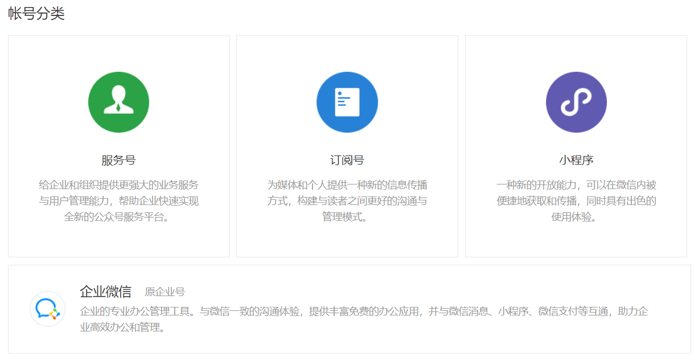

一般意义上，我们所说的公众号主要是指服务号和订阅号。

#### 区别

 https://kf.qq.com/faq/120911VrYVrA130805byM32u.html 

未认证/认证的订阅号/服务号的接口权限区别，在如下位置查看：

* 腾讯官方开发文档  https://developers.weixin.qq.com/doc/offiaccount/Getting_Started/Explanation_of_interface_privileges.html 

查看自己公众号已经获得的接口权限：

公众号管理后台：开发——接口权限

### 2、账号注册

* 注册免费

* 注册时选择账号类型，账号类型一经注册无法更改

* 注册流程

  * 个体户
  * 政府
  * 个人
  * 媒体
  * 其他组织
  * [企业](https://kf.qq.com/faq/120911VrYVrA151013MfYvYV.html)

* 数量限制

   个人可注册1个帐号，个体工商户、企业、其他组织可注册2个帐号，政府和媒体可注册50个帐号。 

### 3、账号认证

* 微信认证及年审都是1次300元，海外版99美元1次，不能一次性支付多年审核费用，需要1年1审，无论认证成功或者失败，费用不退还。
* 小程序首次认证通过后，无需再年审。
* 不能复用已认证的公众号资质去认证其他账号。
* 政府机关单位、基金会、国外政府机构驻华代表处认证免费。
*  帐号主体为个人
  * 2014年8月26号前注册，可以认证
  * 2014年8月26号后注册，不支持认证
* 认证申请流程
  * 政府/事业单位
  * 个体工商户
  * 媒体
  * [企业类型](https://kf.qq.com/faq/161220Brem2Q161220uUjERB.html)
  * 其他组织

### 4 、公众号和小程序关联

* 公众号可关联同一主体的10个小程序，不同主体的3个小程序；
* 1个小程序可关联最多500个公众号，1个月可以新增关联500次。
* 公众号关联小程序不要求已发布，但未发布的小程序不可设置展示在公众号资料页、图文消息、自定义菜单等场景。
* 关联的意义：

## 二、功能介绍（订阅号+服务号）

### 1、素材管理

#### 类型

##### 临时素材

* 媒体文件在微信后台保存时间为3天

* 上传临时素材的格式、大小限制：？？？

  图片（image）: 2M，支持PNG\JPEG\JPG\GIF格式

  语音（voice）：2M，播放长度不超过60s，支持AMR\MP3格式

  视频（video）：10MB，支持MP4格式

  缩略图（thumb）：64KB，支持JPG格式

* 目前只能通过开发接口上传。

##### 永久素材

对于常用的素材，开发者可通过本接口上传到微信服务器，永久使用。新增的永久素材也可以在公众平台官网素材管理模块中查询管理。

1、最近更新：永久图片素材新增后，将带有URL返回给开发者，开发者可以在腾讯系域名内使用（腾讯系域名外使用，图片将被屏蔽）。

2、公众号的素材库保存总数量有上限：图文消息素材、图片素材上限为100000，其他类型为1000。

3、素材的格式大小等要求与公众平台官网一致：？？？？

图片（image）: 2M，支持bmp/png/jpeg/jpg/gif格式

语音（voice）：2M，播放长度不超过60s，mp3/wma/wav/amr格式

视频（video）：10MB，支持MP4格式

缩略图（thumb）：64KB，支持JPG格式

###### 类型

* 图片

  * 10M，支持bmp，png，jpeg，jpg，gif格式

* 音频

  * 格式支持mp3、wma、wav、amr、m4a，文件大小不超过200M，时长不超过1小时

* 视频

  * 视频大小限制在30分钟以内，支持主流的视频格式
    * 常见在线流媒体格式：mp4、flv、f4v、webm
    * 移动设备格式：m4v、mov、3gp、3g2
    * RealPlayer：rm、rmvb
    * 微软格式：wmv、avi、asf
    * MPEG 视频：mpg、mpeg、mpe、ts
    * DV格式：div、dv、divx
    * 其他格式：vob、dat、mkv、lavf、cpk、dirac、ram、qt、fli、flc、mod

* 图文消息

  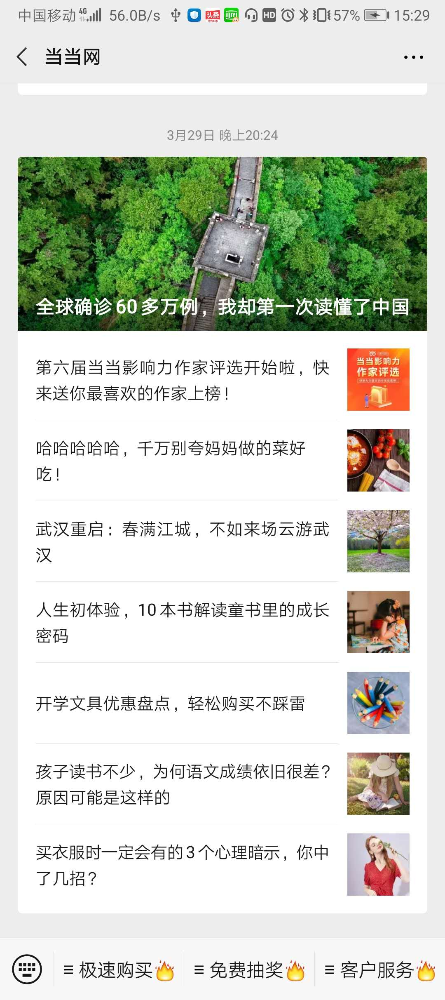

  * 每个图文消息素材最多可以增加 8 篇文章。

  * 文章可选类型：

    * 图文（文章）

      内容可包括文字、图片、视频、音频、超链接、小程序、投票、模板等。

      音频除来自素材库，还可以直接搜索音乐插入文章中。

      超链接？？？

    * 视频

      来源：本地上传；素材库；腾讯视频链接；微信公众号文章链接；视频详情页链接

      每篇文章最多添加3个视频。

    * 音频
  
      来源：本地上传；素材库；
    
    * 图片
    
      来源：本地上传；素材库；
    
    * 转载（分享成功并声明原创的文章链接）
    

#### 开发接口

* 素材管理接口对所有***认证的***订阅号和服务号开放。
* 临时素材的新增和获取。
* 对永久素材的增、删、改、查。
* 获取素材总数和列表。

### 2、自定义菜单

公众号管理后台——功能——自定义菜单。

官方文档 https://kf.qq.com/faq/120911VrYVrA150210BBJvei.html 

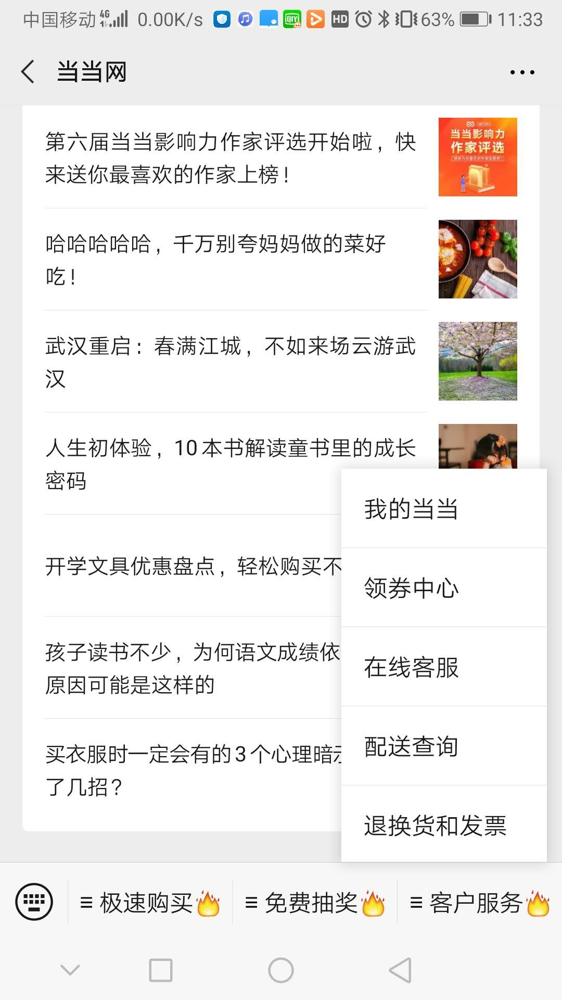

* 最多添加3个一级菜单，菜单名称仅支持中英文和数字，字数不超过4个汉字或8个字母。

* 最多添加5个子菜单，菜单名称 仅支持中英文和数字，字数不超过8个汉字或16个字母。

* 菜单动作
  * 跳转网页 
    
    https://kf.qq.com/faq/120911VrYVrA150212ENnyqM.html 
    
    * 目前非认证订阅号，自定义菜单动作仅支持跳转至素材库文章、历史消息、页面模板，不支持跳转外部链接。
    
  * 跳转小程序
  
    * 可跳转至已绑定的小程序
  
  * 发送消息
    * 纯文字
      
      非认证订阅号不支持设置纯文字类型消息
      
    * 图文消息（素材库，新建，转载）
    
    * 图片
    
    * 音频
    
    * 视频
  
* 开发者接口

   https://developers.weixin.qq.com/doc/offiaccount/Custom_Menus/Creating_Custom-Defined_Menu.html 

  * 可以通过接口实现菜单的创建、查询、删除接口；
  * 个性化菜单，根据用户标签、性别、操作系统、地区、语言设置不同的菜单
  * 事件推送：用户点击自定义菜单后，微信会把点击事件推送给开发者 
  * 通过开发者接口，自定义菜单还可以实现如下动作：
    * 弹出地理位置选择器
    * 弹出扫码页面
    * 弹出微信相册发图器 
    * 弹出拍照或者相册 
    * 弹出系统拍照 

### 3、消息管理

#### 发给公众号消息

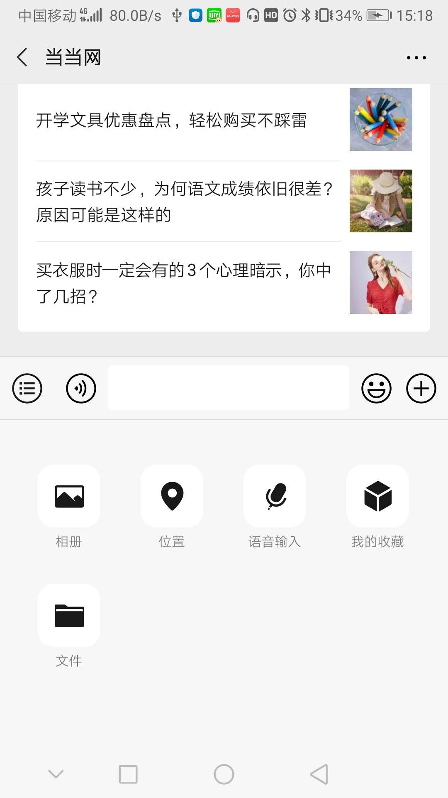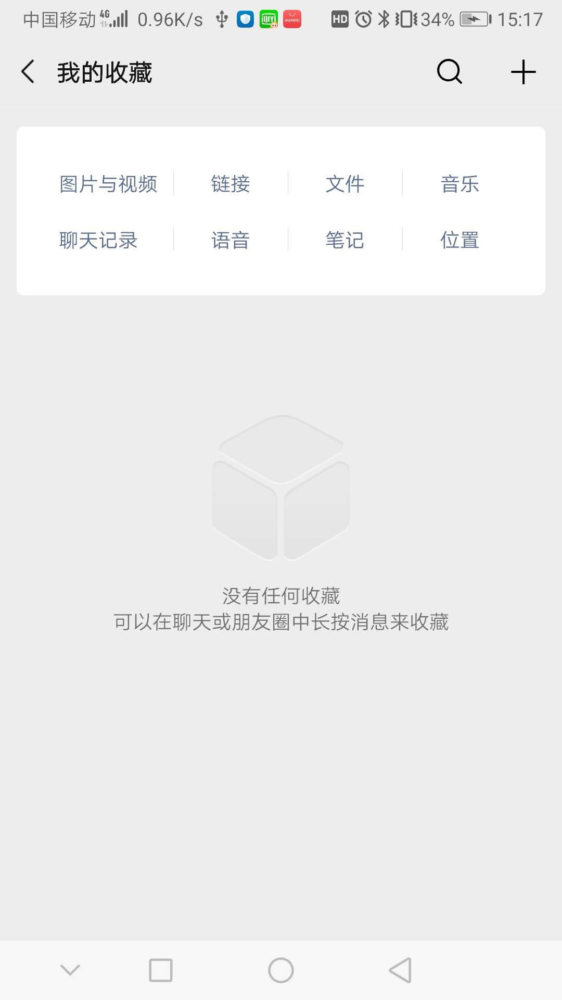

支持的类型包括文字、表情、音频、图片、视频、位置、文件、链接等。

#### 消息发送方式

##### 自动回复

* 被关注回复

  * 支持文字、图片、音频、视频

  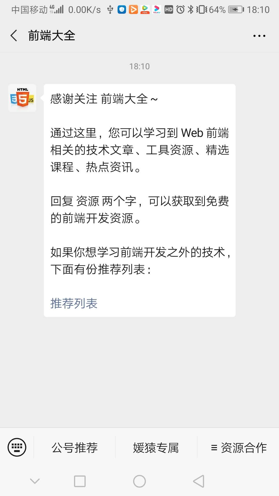

* 收到消息回复

  * 消息自动回复：1个小时内回复1-2条内容；
  * 支持文字、图片、音频、视频，暂不支持设置图文、网页地址消息回复；
  * 消息自动回复只能设置一条信息回复。

  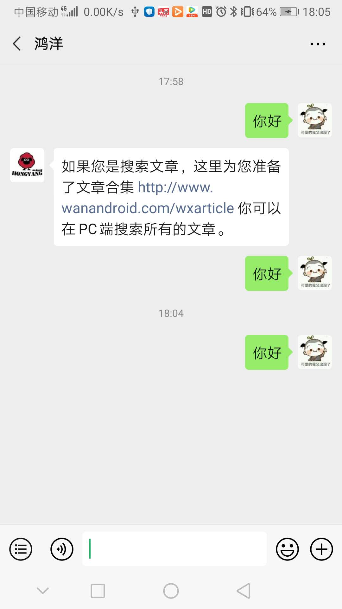

* 关键词回复

  https://kf.qq.com/faq/120322fu63YV130422rYNjYB.html 

  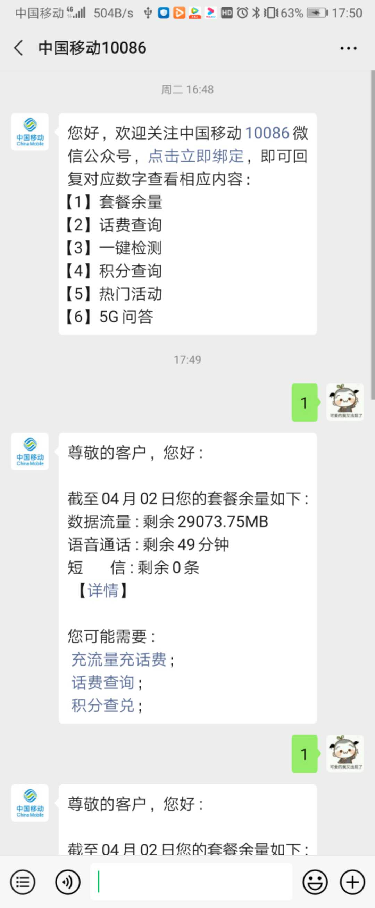

  * 微信公众平台认证与非认证用户的关键词自动回复设置规则上限为200条规则 
  * 每条规则内最多设置10条关键词 ，若设置了相同的关键字，但回复内容不同，系统会随机回复。 
  * 每条规则内最多设置5条回复 , 若设置了多个回复内容（没有设置“回复全部”），系统会随机回复。 

##### 主动回复

公众号管理后台——管理——消息管理

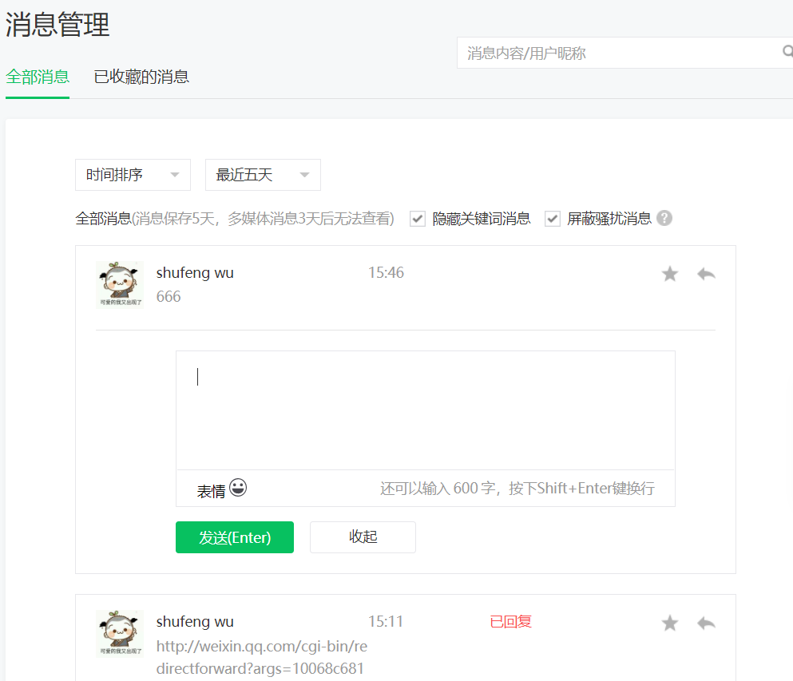

获取最近五天内的消息，可以对用户的消息进行快捷回复。

##### 即时消息

公众号管理后台——管理——用户管理

* 头像或者昵称，页面弹出与此用户的聊天页面。

* 可发送的内容包括：文字、图片、音频、视频、图文消息（素材库，新建，转载）。

##### 消息群发

公众号管理后台——管理——用户管理

### 4、用户管理

公众号管理后台——管理——用户管理

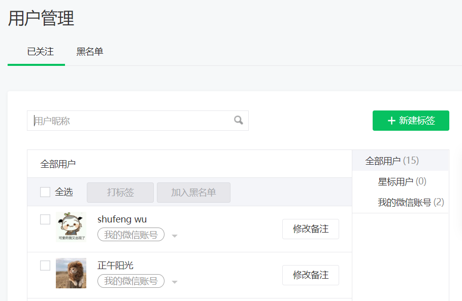

* 用户标签：一个公众号，最多可以创建100个标签。
* 黑名单
* 用户备注

#### 开发接口

[官方文档](https://developers.weixin.qq.com/doc/offiaccount/User_Management/User_Tag_Management.html)

* 用户标签管理：对标签进行增、删、改、查，对用户打标签、取消标签。

* 设置用户备注名

* 获取用户基本信息：单个或批量获取用户的昵称、性别、国家、城市、性别、语言、头像、关注时间、备注、标签、用户关注的渠道来源等信息。

  > [OpenID和UnionID机制](https://developers.weixin.qq.com/doc/offiaccount/User_Management/Get_users_basic_information_UnionID.html#UinonId)

* 获取用户列表：获取关注用户列表

* 获取用户地理位置(经纬度)

  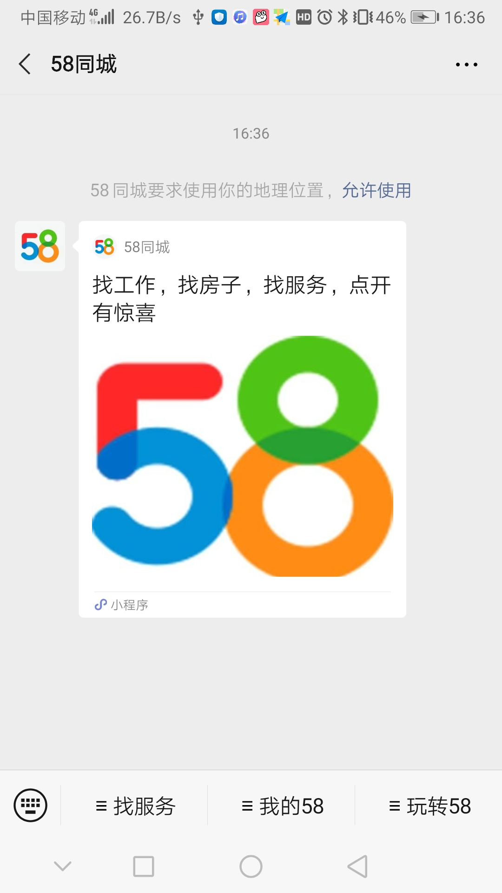

  * 开通了上报地理位置接口的公众号，用户在关注后进入公众号会话时，会弹框让用户确认是否允许公众号使用其地理位置。弹框只在关注后出现一次，用户以后可以在公众号详情页面进行操作。

    > 开通上报地理位置接口方法：
    >
    > 公众号管理后台——开发——接口权限——对话服务——用户管理——获取用户地理位置

  * 用户同意上报地理位置后，每次进入公众号会话时，都会在进入时上报地理位置。

* 黑名单管理：黑名单列表，拉黑，取消拉黑

##### 接口权限

| 接口名称                  | 未认证订阅号 | 微信认证订阅号 | 未认证服务号 | 微信认证服务号 |
| :------------------------ | :----------: | :------------: | :----------: | :------------: |
| 用户管理-用户分组管理     |              |       有       |              |       有       |
| 用户管理-设置用户备注名   |              |       有       |              |       有       |
| 用户管理-获取用户基本信息 |              |       有       |              |       有       |
| 用户管理-获取用户列表     |              |       有       |              |       有       |
| 用户管理-获取用户地理位置 |              |                |              |       有       |
| 用户管理-用户基本信息     |              |                |              |       有       |

### 5、留言管理

公众号管理后台——功能——留言管理

对群发消息的留言进行打开/关闭、查看、置顶、精选、回复、标记垃圾留言、删除等操作。

#### 开发接口

https://developers.weixin.qq.com/doc/offiaccount/Comments_management/Image_Comments_Management_Interface.html

##### 接口权限

对所有公众号都开放。

### 6、投票管理

### 7、页面模板

按照页面模板，将自己的多篇图文组合成一个新的公众号页面，可复制链接放到自定义菜单发布。

### 8、赞赏管理

公众号每以同一作者名发表3篇或3篇以上的原创文章，即可创建一个赞赏账户，用于赞赏收款。同一公众号最多可以邀请开通3个赞赏账户。

https://mp.weixin.qq.com/s/1OI2XAaeMgq3MjuE1A9eQQ

### 9、原创管理

* 原创文章的管理

  * 转载设置

    单篇可转载帐号：通过添加转载帐号，授予指定公众号对该篇文章具有可修改或不显示转载来源的转载权限。

  * 转载数据的查看

* 长期转载帐号管理

### 11、微信门店

门店管理接口为商户提供门店批量导入、查询、修改、删除等主要功能，方便商户快速、高效进行门店管理和操作。

#### 门店小程序

##### 申请条件

- 主体为企业、媒体、政府和其他组织的公众号

##### 功能介绍

- 门店小程序，是公众平台向商户提供的对其线下实体门店相关功能的管理能力。[查看使用指南](http://kf.qq.com/faq/170426euiEzA170426FFfMnU.html)
- 商户可在门店小程序插件内管理自己的门店信息，并将门店信息使用到附近的小程序、卡券、公众号、摇周边、微信Wi-Fi等业务。

### 12、微信小店

公众号管理后台——功能——添加功能插件——微信小店

#### 申请条件

必须开通微信支付(认证的订阅号和服务号可申请开通微信支付)。

#### 功能介绍

- 微信小店是在微信支付能力的基础上，支持商家进行添加商品、商品管理、订单管理、货架管理、维权仲裁等操作的功能。有开发能力的商家可以通过接口批量操作，快速开店。
- 开通后，你可以在微信小店中进行小店的开启、运营和使用。
- 普通用户可直接通过小店功能（公众号管理）管理小店，开发者则可以通过开发接口来实现更灵活的小店运营。

#### 开发接口

* 商品管理接口

  对商品增、删、改、查、上架、下架。

* 库存管理接口

  增加减少商品库存

* 邮费模板管理接口

  生成、修改、删除和查询支持复杂邮费计算的邮费模板。

* 分组管理接口

  对已有商品进行分组管理。接口包括增加、删除、修改和查询分组。

* 货架管理接口

  增加、删除、修改和查询货架。

* 订单管理接口

  按订单状态和时间来获取订单，并对订单进行发货。

* 功能接口

  目前功能接口暂时只支持上传图片接口一项。

### 13、卡券功能

公众号管理后台——功能——添加功能插件——卡券功能

#### 申请条件

必须开通微信支付(认证的订阅号和服务号可申请开通微信支付)。

#### 功能介绍

卡券功能，是提供给商户或第三方的一套派发优惠券，经营管理会员的工具，可在公众平台或通过接口创建卡券，多种渠道投放给用户，用户用券时需核销卡券，核销后可查看数据、进行对账。

主要能力：

- 朋友共享的优惠券——可利用社交链快速扩散传播，一人领券，本人和朋友皆可看到并使用。
- 普通优惠券——传统优惠券电子版，领取后仅本人可见可用，支持多种类型：折扣券、代金券、兑换券、团购券、优惠券。
- 会员卡——支持折扣、积分等玩法，并提供会员管理、数据报表等丰富工具，便于商户高效运营会员。
- 微信买单——无需进行微信支付开发，同时与会员卡，代金券，折扣券打通，为你积累用户消费数据，用于经营参考
- 储值功能——会员卡商户无需申请，可直接通过API接口，使用“余额展示”功能，将会员余额显示在微信会员卡首页。具有预付卡资质的商家可申请“储值”功能，申请成功后，可通过API接口设置此入口，帮助会员通过微信支付为会员卡充值。
- 特殊票券
  - 会议/演出门票
  - 景区门票
  - 电影票
  - 飞机票
- 第三方代制模式——经商户授权后，可代子商户快速接入并使用卡券功能，支持通过公众平台或API接口实现该功能。

#### 开发接口

https://developers.weixin.qq.com/doc/offiaccount/Cards_and_Offer/WeChat_Coupon_Interface.html

##### 接口权限 

| 接口名称     | 未认证订阅号 | 微信认证订阅号 | 未认证服务号 | 微信认证服务号 |
| :----------- | :----------: | :------------: | :----------: | :------------: |
| 微信卡券接口 |              |     需申请     |              |     需申请     |

### 14、电子发票

#### 申请条件

- 必须开通微信认证

#### 功能介绍

- 电子发票功能，是提供给商户或第三方的一套电子发票技术解决方案。商户和第三方选择第三方开票方提供的电子发票套餐，并根据套餐权限在其微信公众帐号中申请、开具、接收、管理电子发票。
- 主要能力：
  1、电子发票接入：向希望开通电子发票的商户提供一套标准化的接入流程，商户可以在流程中选择开票服务方套餐、提交资料、生成购买电子发票开票服务的工单并跟踪工单进度。
  2、电子发票开具：在税控设备部署成功的情况下，商户或第三方可以通过API接口传入电子发票开票信息，开具电子发票。
  3、电子发票冲红：通过API接口，根据发票号码、代码冲红本账号已开具成功的电子发票。
  4、电子发票查询：用后台接口根据开票请求流水号查询本商户已经开具的电子发票。

### 15、一物一码

#### 申请条件

- 必须开通微信认证

#### 功能介绍

- 一物一码是微信提供给商家的包含商品赋码、小程序能力到扫码数据和用户分析的一系列功能。其中：
- 商品赋码：可以安全获取商品的唯一二维码，微信官方码可以支持迷你码、扫码跳转小程序等诉求。
- 数据看板：使用官方码印刷并关联小程序，消费者扫码后，可以获取详细扫码数据，和扫码用户分析。
- 小程序能力：通过小程序给扫码用户发红包，小程序关注公众号组件等。
- 用户回流：扫码用户公众号图文消息再触达，小程序多入口回流等。

### 16、微信连接Wi-Fi

商家接入微信连Wi-Fi后，顾客无需输入繁琐的Wi-Fi密码，通过微信扫二维码等方式即可快速上网。

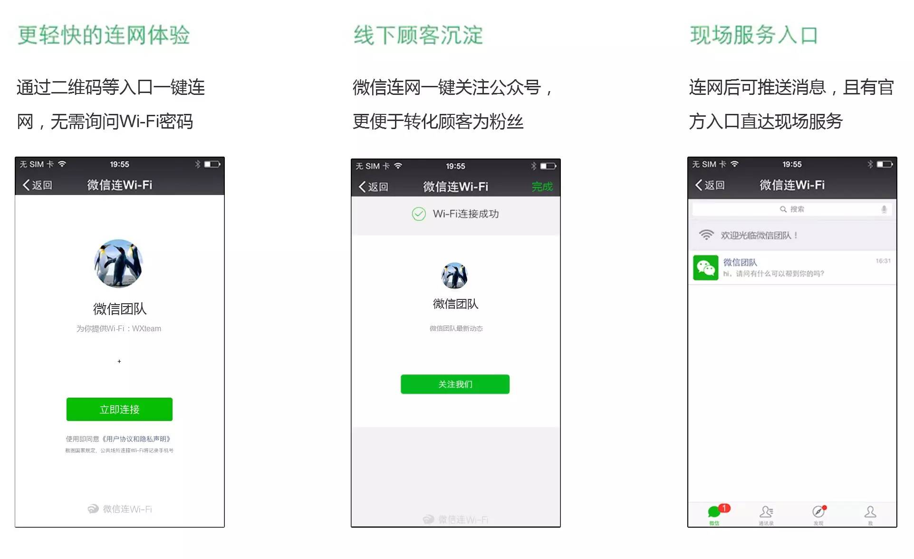

* 微信顶部常驻入口

* 商家主页展示

* 连网后公众号下发消息

  顾客到店并连接Wi-Fi后，会触发连网成功事件推送。开发者接收到此事件后，可以调用客服消息通过公众号向连网用户发送消息，包括文字、卡券等。

* 卡券投放

* 数据统计

  查询一定时间范围内的WiFi连接总人数、微信方式连Wi-Fi人数、商家主页访问人数、连网后消息发送人数、新增公众号关注人数和累计公众号关注人数。查询的最长时间跨度为30天。

### 开发接口

### 17、统计功能

#### 用户分析

公众号管理后台——统计——用户分析

* 用户增长：新关注人数、取消关注人数、净增关注人数、累计关注人数，以及趋势图

* 用户属性

  * 人口特征：性别、年龄、语言
  * 地域归属：省级分布、地级分布
  * 访问设备：终端分布

* 常读用户分析

  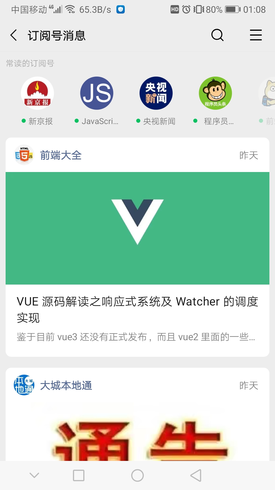

  常读用户：在订阅号消息列表顶部“常读订阅号”横栏常驻你的公众号的用户。

  * 数量
  * 性别
  * 年龄
  * 城市终端
  * 终端分布

#### 内容分析

公众号管理后台——统计——内容分析

* 群发分析：群发的消息阅读、消息分享等数据的统计
* 视频分析：视频播放量、视频分享等数据的统计

#### 菜单分析

公众号管理后台——统计——菜单分析

菜单项点击次数、人数等数据的统计

#### 消息分析

公众号管理后台——统计——消息分析

* 消息分析：消息发送人数、次数统计
* 消息关键词：消息关键词出现次数统计

#### 接口分析

公众号管理后台——统计——接口分析

基础消息接口的调用次数、失败率、耗时等数据的统计

#### 网页分析

公众号管理后台——统计——网页分析

* JSSDK接口调用数据统计

* JSSDK页面访问量统计

#### 开发接口

https://developers.weixin.qq.com/doc/offiaccount/Analytics/User_Analysis_Data_Interface.html

* 用户分析：用户增减数据、累计用户数据
* 图文分析：图文的阅读、分享、收藏等数据的统计
* 消息分析：关注者消息发送和分布数据
* 广告分析：广告拉取量、曝光量、点击量等。
* 接口分析：基础消息接口的调用次数、失败率、耗时等数据的统计

##### 接口权限

用户分析、图文分析、消息分析、接口分析接口对认证的公众号开放。

广告分析向所有成为流量主(广告分成)的公众号开发者开放数据接口。

## 三、接口接入

### 接入

接入微信公众平台开发，开发者需要按照如下步骤完成：

1、填写服务器配置

2、验证服务器地址的有效性

3、依据接口文档实现业务逻辑

https://developers.weixin.qq.com/doc/offiaccount/Basic_Information/Access_Overview.html

### 接口域名

https://developers.weixin.qq.com/doc/offiaccount/Basic_Information/Interface_field_description.html

### Access token

access_token是公众号的全局唯一接口调用凭据，公众号调用各接口时都需使用access_token。

https://developers.weixin.qq.com/doc/offiaccount/Basic_Information/Get_access_token.html

### 测试号

### 在线调试

### 预警排查指引

微信公众平台已对外开放接口报警，当微信服务器向开发者推送消息失败次数达到预定阈值时，会将报警消息发送到指定微信报警群中（设置方式：公众平台->开发-运维中心->接口报警），请开发者积极主动关注报警，即时解决故障，提高微信公众号的服务质量。

## 四、微信网页开发

### 1、iOS WKWebview内核适配

https://developers.weixin.qq.com/doc/offiaccount/OA_Web_Apps/iOS_WKWebview.html

### 2、网页授权

1、添加授权回调域名

在微信公众号请求用户网页授权之前，开发者需要先到公众平台官网中的“开发 - 接口权限 - 网页服务 - 网页帐号 - 网页授权获取用户基本信息”的配置选项中，修改授权回调域名。

**关于网页授权的两种scope的区别说明**

**关于网页授权access_token和普通access_token的区别**

具体而言，网页授权流程分为四步：

1、引导用户进入授权页面同意授权，获取code

2、通过code换取网页授权access_token（与基础支持中的access_token不同）

3、如果需要，开发者可以刷新网页授权access_token，避免过期

4、通过网页授权access_token和openid获取用户基本信息（支持UnionID机制）

图？？？？？？？？？？？？？？？？？？？？？？？？？

### 3、网页开发样式库——WeUI

https://developers.weixin.qq.com/doc/offiaccount/OA_Web_Apps/web_development_style_library.html

### 4、JS-SDK

功能：

https://developers.weixin.qq.com/doc/offiaccount/OA_Web_Apps/JS-SDK.html

| 接口名称                            | 未认证订阅号 | 微信认证订阅号 | 未认证服务号 | 微信认证服务号 |
| :---------------------------------- | :----------- | :------------- | :----------- | :------------- |
| 微信JS-SDK-基础接口                 | 有           | 有             | 有           | 有             |
| 微信JS-SDK-分享接口                 |              | 有             |              | 有             |
| 微信JS-SDK-图像接口                 | 有           | 有             | 有           | 有             |
| 微信JS-SDK-音频接口                 | 有           | 有             | 有           | 有             |
| 微信JS-SDK-智能接口（网页语音识别） | 有           | 有             | 有           | 有             |
| 微信JS-SDK-设备信息                 | 有           | 有             | 有           | 有             |
| 微信JS-SDK-地理位置                 | 有           | 有             | 有           | 有             |
| 微信JS-SDK-界面操作                 | 有           | 有             | 有           | 有             |
| 微信JS-SDK-微信扫一扫               | 有           | 有             | 有           | 有             |
| 微信JS-SDK-微信小店                 |              |                |              | 有             |
| 微信JS-SDK-微信卡券                 |              | 有             |              | 有             |
| 微信JS-SDK-微信支付                 |              |                |              | 有             |

### 5、web开发者工具

https://developers.weixin.qq.com/doc/offiaccount/OA_Web_Apps/Web_Developer_Tools.html

### 6、DarkMode 适配指南

https://developers.weixin.qq.com/doc/offiaccount/OA_Web_Apps/DarkMode.html